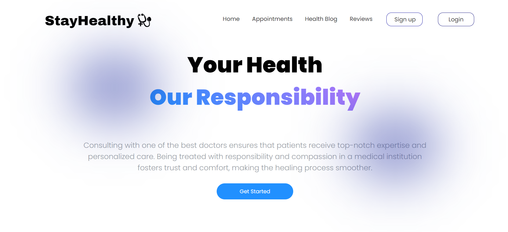
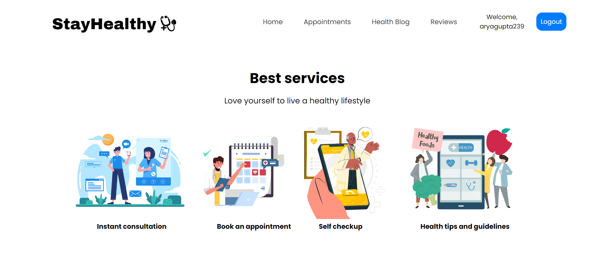
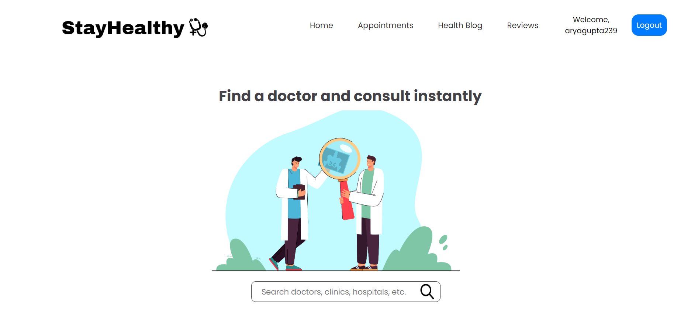
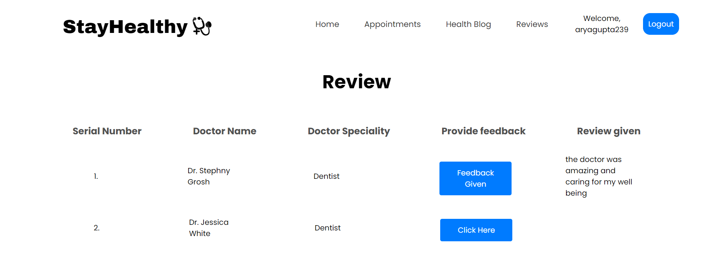
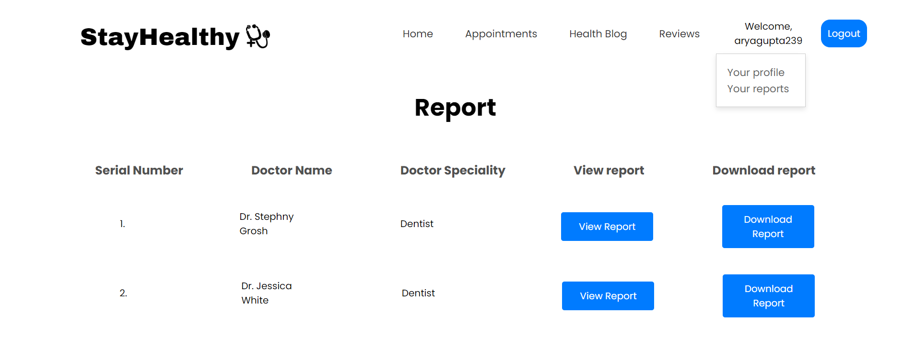
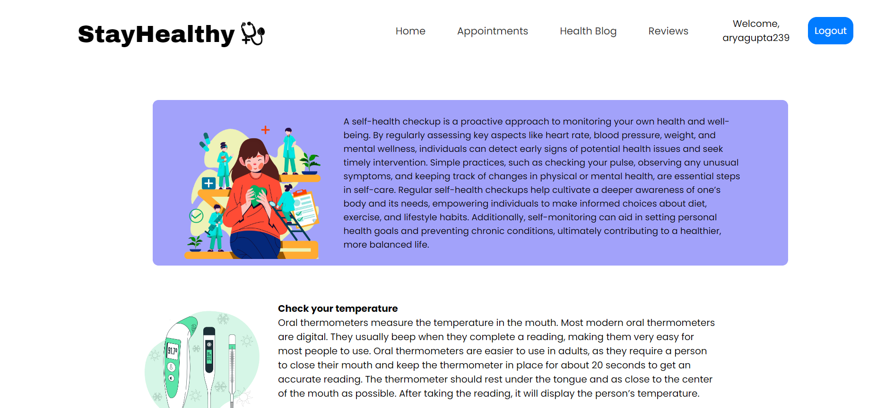

# StayHealthy medical appointment booking application

This website is a part of IBM's front end development capstone project. It's a fully functional medical appointment booking website which allows users to book instantly or on a preferred date according to their convenience. It also allows users to provide feedback on the medical practitioners for constant upgrade to the system. It enables users to view and download their medical reports as well.

This site can be viewed here : https://test-med-app-1.onrender.com

Here are a few screenshots :

home page: 

service page:

consultation site:

review page:

report page:

self checkup page:

